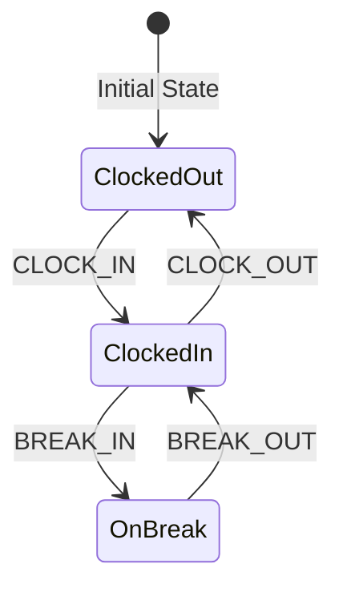

# Domain Model & Business Rules

This document formalizes the core domain model, business rules, and state machines for the TimeSlip-HR application.

## Core Entities

```mermaid
companies [icon: building, color: teal] {
  id string pk
  name string
  createdAt timestamp
  updatedAt timestamp
}

users [icon: user, color: blue] {
  id string pk
  companyId string
  email string
  passwordHash string
  displayName string
  role string  // ADMIN | EMPLOYEE
  employeeId string  // nullable; links employee user account
  isActive boolean
  lastLoginAt timestamp
  createdAt timestamp
  updatedAt timestamp
}

employees [icon: id-card, color: indigo] {
  id string pk
  companyId string
  employeeNumber string  // unique per company
  firstName string
  lastName string
  department string
  position string
  employmentType string  // HOURLY | SALARIED
  hourlyRate number      // nullable for salaried
  monthlySalary number   // nullable for hourly
  isActive boolean
  createdAt timestamp
  updatedAt timestamp
}

time_events [icon: clock, color: green] {
  id string pk
  employeeId string
  type string           // CLOCK_IN | CLOCK_OUT | BREAK_IN | BREAK_OUT
  happenedAt timestamp  // server-authoritative time
  source string         // KIOSK | WEB | MOBILE
  deviceId string
  ipAddress string
  createdByUserId string // nullable (system/kiosk), or admin override
  createdAt timestamp
}

pay_periods [icon: calendar, color: orange] {
  id string pk
  companyId string
  startDate date
  endDate date
  status string      // OPEN | CLOSED
  createdAt timestamp
  updatedAt timestamp
}

timesheets [icon: clipboard, color: purple] {
  id string pk
  employeeId string
  payPeriodId string
  status string         // DRAFT | REVIEWED | APPROVED | LOCKED
  generatedAt timestamp
  reviewedAt timestamp
  approvedAt timestamp
  approvedByUserId string
  lockedAt timestamp
  createdAt timestamp
  updatedAt timestamp
}

timesheet_days [icon: calendar-days, color: purple] {
  id string pk
  timesheetId string
  workDate date
  regularMinutes number
  breakMinutes number
  overtimeMinutes number
  anomaliesJson string  // serialized anomalies (missing clock-out, overlaps, etc.)
  createdAt timestamp
  updatedAt timestamp
}

timesheet_adjustments [icon: edit-3, color: red] {
  id string pk
  timesheetDayId string
  field string          // REGULAR | BREAK | OVERTIME
  deltaMinutes number
  reason string
  createdByUserId string
  createdAt timestamp
}

payslips [icon: file-text, color: amber] {
  id string pk
  employeeId string
  payPeriodId string
  status string          // DRAFT | FINALIZED | VOID
  totalRegularMinutes number
  totalOvertimeMinutes number
  grossPay number
  totalDeductions number
  netPay number
  generatedByUserId string
  generatedAt timestamp
  finalizedAt timestamp
  createdAt timestamp
  updatedAt timestamp
}

payslip_items [icon: list, color: amber] {
  id string pk
  payslipId string
  type string         // EARNING | DEDUCTION
  code string
  label string
  amount number
  metaJson string     // optional (tax basis, notes, etc.)
  createdAt timestamp
}

settings [icon: settings, color: gray] {
  id string pk
  companyId string
  timezone string
  currency string
  roundingRule string     // e.g., NONE | NEAREST_5 | NEAREST_15
  breakPolicy string      // e.g., PAID | UNPAID | RULE_BASED
  overtimeRule string     // e.g., NONE | DAILY_GT_8 | WEEKLY_GT_40
  gracePeriodMinutes number
  createdAt timestamp
  updatedAt timestamp
}
```

## TimeLog (TimeEvent) State Machine

The `TimeEvent` entity tracks individual clock-in/out and break events. Valid transitions are strictly enforced.



### Transition Rules

| Current State | Valid Next Event | Result State |
|---------------|------------------|--------------|
| Clocked Out   | `CLOCK_IN`       | Clocked In   |
| Clocked In    | `BREAK_IN`       | On Break     |
| Clocked In    | `CLOCK_OUT`      | Clocked Out  |
| On Break      | `BREAK_OUT`      | Clocked In   |

### Validation Rules
1.  **No Overlapping Sessions**: An employee cannot clock in if they are already clocked in.
2.  **Required Sequences**: A `BREAK_OUT` cannot occur without a preceding `BREAK_IN`. A `CLOCK_OUT` cannot occur without a preceding `CLOCK_IN`.
3.  **Idempotency**: Duplicate event submissions (same `requestId`) must be ignored safely.

## Time Computation Rules

These rules govern how raw `TimeEvent` data is aggregated into a `Timesheet`.

### Rounding
-   Time is rounded to the nearest **15-minute interval**.
-   Clock-in times are rounded **up** (e.g., 8:07 AM → 8:15 AM).
-   Clock-out times are rounded **down** (e.g., 5:08 PM → 5:00 PM).

### Grace Periods
-   A **5-minute grace period** is allowed for clock-ins. (e.g., clocking in at 8:05 AM is considered an "on-time" arrival for an 8:00 AM shift).

### Break Time
-   **Unpaid Breaks**: By default, break time is unpaid and subtracted from total worked hours.
-   `totalWorkedMinutes = (clockOut - clockIn) - totalBreakMinutes`

### Overtime
-   (Future) Define the number of regular hours per day/week before overtime kicks in.
-   (Future) Define overtime multiplier (e.g., 1.5x for hours > 8/day).

## Pay Computation Rules

### Hourly Employees
`grossPay = totalWorkedHours * hourlyRate`

### Daily Employees
`grossPay = daysWorked * dailyRate`

### Salaried Employees
`grossPay = monthlySalary / payPeriodsPerMonth`
